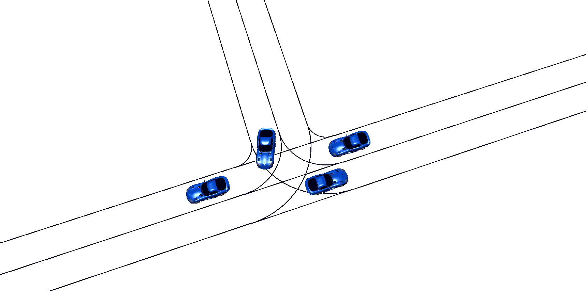

## About the Tutorial
BARK is an open-source benchmarking platform to foster comparison of
approaches developed in the field of interactive decision making for self-driving vehicles. BARK offers a unique approach with behavior models being used exchangeably for prediction, planning and simulation. To
grow the community around a common benchmarking platform, we want to enable
participants to employ the platform within research and industry projects.

Attendees of the tutorial will
- Understand principles of state-of-the-art approaches in interactive behavior planning (POMDP planning, Multi-Agent planning)
- Understand pros and cons of state-of-the-art approaches
- Understand requirements on benchmarking platforms to systematically develop interactive behavior planners
- Gain hands-on-experience with BARK as benchmarking platform for interactive planners
- Implement and benchmark their own interactive-behavior planner

 
### Topics of interest:
- Behavior Benchmarking
- Autonomous Driving
- Multi-Agent Systems
- Interactive Planning
 
### Intended audience:
- PhD studens (in robotics, in software engineering) who want to practically learn about cutting edge benchmarking approaches for interactive decision making algorithms. This tutorial provides a good entry point to understand the state-of-the-art in this field. It gives them an understanding of the current challenges and upcoming future research directions. By gaining hands-on-experience with problems in interactive decision making, new researches are encouraged to directly tackle the open problems in this field.
- Experienced robotics researchers from academia and industry who want to get to know a new benchmarking platform for autonomous driving and multi-agent systems tailored to the analysis of interactive decision making algorithms. BARK's offers a unique approach with behavior models being used exchangeably for prediction, planning and simulation. This could attract domain experts providing them a comprehensive framework for research in behavior modeling.
- Practitioners from industry who want to extend their workflow and easily benchmark developed planning approaches against other state-of-the-art models in a variety of standard scenarios.

To get the most out of the tutorial, the participants should have some background in decision making, i.e understand the fundamental principles of decision
problems, e.g. MDPs and POMDPs, and have experience with Python and a basic understanding of C++.

### Resources

Relevant links to give an impression on the background on which this tutorial is based:
- [Bark Core on GitHub](https://github.com/bark-simulator/bark)
- [Bark Paper](https://arxiv.org/abs/2003.02604)
- [Bark Ecosystem on GitHub](https://github.com/bark-simulator)

## News:
(Last update June 5th)

- June 5th 2020: Tutorial website available

## Program
The tutorial mixes slide presentations and interactive sessions. Short spot light talks will provide hands-on experience from industry researchers.
### Time Plan
| Time        | Talk           | Comment  |
| ------------- |:-------------:| -----:|
| 9:00 - 9:30      | Principles of Interactive Decision Making | Slides presentation |
| 9:30 - 10:00      | Requirements on Benchmarking & Introduction to BARK | Slides presentation |
| 10:00 - 10:30     | BARK Installation & Setup | Interactive Session |
| 10:30 - 11:00      | Coffee Break |  |
| 11:00 - 12:00    | Design of Scenario Set for Benchmarking, Start Benchmarking | Interactive Session |
| 12:00 - 12:30      | Multi-Agent and Uncertainty-Aware Planning | Slides Presentation |
| 12:30 - 13:00    | Analysis and Discussion of Benchmark, Open Questions | Interactive Session  |
| 13:00      | End |   |

### Guests Speakers 

- Constantin Hubmann, PhD, Toyota Research Institute, US

## About BARK

Predicting and planning interactive behaviors in complex traffic situations presents a challenging task. Especially in scenarios involving multiple traffic participants that interact densely, autonomous vehicles still struggle to interpret situations and to eventually achieve their own driving goal. BARK is a semantic simulation framework for autonomous agents with a special focus on autonomous driving. Its behavior model-centric design allows for the rapid development, training and benchmarking of various decision-making algorithms.

In BARK, behavior models are (re-)used for planning, prediction, and simulation. A range of models is currently available, ranging from simplistic car-following to rule-based intersection crossing models and models derived from the planning community such as Monte-Carlo Tree Search and Reinforcement Learning-based behavior models.

In addition to that BARK provides an easy to use benchmarking process to compare various behavior models based on using BARK's data-based or sampling-based scenario generation. BARK supports replay of the [Interaction Dataset](https://interaction-dataset.com/) with the possibility to (partially) exchange recorded behavior with interactive models. Coverage-based sampling criteria are supported not only over physical scenario properties such as velocity and vehicle distance ranges, but also over hidden behavior model parameters.

