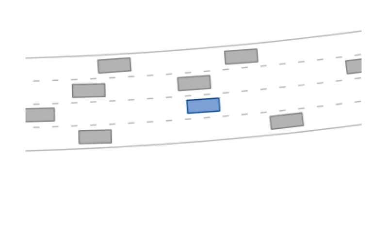
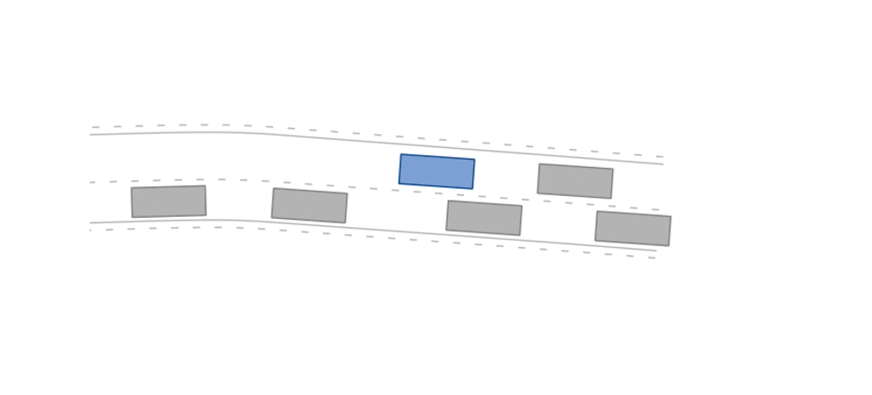
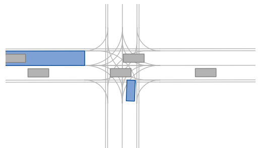

BARK-ML provides several [OpenAI-Gym](https://gym.openai.com) environments implementing various driving scenarios (highway, merging, and intersection ones).

<br />

### Highway Scenario

```python
import gym
import numpy as np
# registers bark-ml environments
import bark_ml.environments.gym  # pylint: disable=unused-import

env = gym.make("highway-v0")

initial_state = env.reset()
terminal = False
while terminal is False:
  action = np.array([0., 0.]) # acceleration and steering-rate
  observed_state, reward, terminal, info = env.step(action)
  print(f"Observed state: {observed_state}, Action: {action}, "
        f"Reward: {reward}, Terminal: {terminal}.")
```

The highway scenario is a curved road with four lanes.
A potential-based reward signal for the desired velocity is used and the episode is terminal once the maximum number of steps (`200`) has been reached or a collision (`reward -= 1`) has occured or the drivable area (`reward -= 1`) has been left.
The other vehicles in the scenario are controlled by the intelligent driver model (IDM).

The highway scenario can use discrete or continuous actions:
*   `highway-v0`: Continuous highway environment
*   `highway-v1`: Discrete highway environment

<div align="center" id="highway">



<em>The highway-v0 environment.</em>

</div>

### Merging Scenario

```python
env = gym.make("merging-v0")
```

In the merging scenario, the ego agent's goal is a `StateLimitsGoal` on the left lane that is reached once its states are in a pre-defined range (velocity range of `[5m/s, 15m/s]`, polygonal area on the left lane, and theta range of `[-0.15rad, 0.15rad]`).
A positive reward (`+1`) is given for reaching the goal and a negative reward for having a collision or leaving the drivable area (`-1`).
Additionally, a distance potential-based reward shaping is used to the centerline of the ego vehicle's goal.
The other vehicles on the left lane are controlled by the intelligent driver model (IDM) and the ones on the right by the MOBIL model.

The merging scenario can use discrete or continuous actions:
*   `merging-v0`: Continuous merging environment
*   `merging-v1`: Discrete merging environment


<div align="center" id="merging">



<em>The merging-v0 environment.</em>

</div>


### Unprotected Left Turn

```python
env = gym.make("intersection-v0")
```

In the unprotected left turn scenario, the ego agent's goal is a `StateLimitsGoal` placed on the top-left lane.
A potential-based reward signal for the distance to the lane centerline is used and the episode is terminal once the maximum number of steps (`100`) has been reached or a collision (`reward -= 1`) has occured or the drivable area (`reward -= 1`) has been left.

The unprotected left turn scenario can use discrete or continuous actions:
*   `intersection-v0`: Continuous intersection environment
*   `intersection-v1`: Discrete intersection environment


<div align="center" id="intersection">



<em class="mt-2 block">The intersection-v0 environment.</em>

</div>
