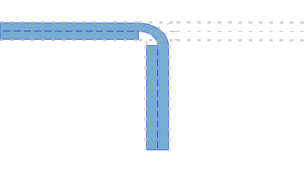

In this section, we will highlight the main building blocks and components of the BARK simulator framework.
</br>
</br>
The <b>core modules</b> of BARK are:

* The `World` and `ObservedWorld` class that contains all elements of the simulation,
* the `Agent` class that represents dynamic objects,
* the `MapInterface` class that contains all map-related functionalities, and
* the model classes that specify how an agent moves/acts within BARK.
</br>
</br>
We only elaborate each of the above components slightly.
For deeper insights, we refer to our [documentation](https://bark-simulator.readthedocs.io/en/latest/).


## World and Observed World

The `World` class contains all objects, maps, and utilities for the simulation in BARK.
<br />
<br />
A shortened implementation of the `World` class:
```cpp
class World : public commons::BaseType {
 public:
  explicit World(const commons::ParamsPtr& params);
  explicit World(const std::shared_ptr<World>& world);
  virtual ~World() {}

  std::vector<ObservedWorld> Observe(const std::vector<AgentId>& agent_ids);
  void Step(const float& delta_time);
  void DoPlanning(const float& delta_time);
  void DoExecution(const float& delta_time);
  virtual std::shared_ptr<World> Clone() const;
  ...
 private:
  world::map::MapInterfacePtr map_;
  AgentMap agents_;
  ObjectMap objects_;
  std::map<std::string, EvaluatorPtr> evaluators_;
  double world_time_;
  rtree_agent rtree_agents_;
  bool remove_agents_;
};
```

The most important class members are the agent map `agents_`, static objects `objects_`, and the `map_`.
The `Step` function calls the `DoPlanning` and then the `DoExecution` function.
Each agent plans in the `DoPlanning` phase using the `ObservedWorld` &ndash; a derived world.
The `Observe` function creates agent-specific observed worlds.
After planning has finished, the `DoExecution` then executes the planned behaviors (trajectories).
<br />
<br />
The `ObservedWorld` stores an `AgentId` for which it also provides additional interfaces and utilities.
Furthermore, during the derivation, effects, such as occlusions can be modeled.
<br />
<br />
Excerpt of the `ObservedWorld` class showing some of the additional functionalities:
```cpp

class ObservedWorld : public World {
 public:
  ObservedWorld(const WorldPtr& world, const AgentId& ego_agent_id) :
    World(world),
    ego_agent_id_(ego_agent_id) {}
  ~ObservedWorld() {}
  FrontRearAgents GetAgentFrontRear() const;
  ...
  std::shared_ptr<const Agent> GetEgoAgent() const {
    return World::GetAgent(ego_agent_id_);
  }
  AgentId GetEgoAgentId() const { return ego_agent_id_; }
  const std::shared_ptr<BehaviorModel> GetEgoBehaviorModel() const {
    return World::GetAgent(ego_agent_id_)->GetBehaviorModel();
  }
  virtual State CurrentEgoState() const {
    return World::GetAgent(ego_agent_id_)->GetCurrentState();
  }
  Point2d CurrentEgoPosition() const {
    return World::GetAgent(ego_agent_id_)->GetCurrentPosition();
  }
  ...
 private:
  AgentId ego_agent_id_;
};
```

## Agent
The agents (vehicles) in BARK are dynamic objects that have a behavior, execution, and dynamic model.
Each agent in BARK has a goal definition.
The behavior model that generates actions and trajectories should try to reach the set goal.
In order to simplify the map handling, we introduce RoadCorridors &ndash; multiple concatenated roads generated by a routing function.
<br />
<br />
Excerpt of the agent class:
```cpp
class Agent : public Object {
 public:
  friend class World;

  Agent(const State& initial_state,
        const BehaviorModelPtr& behavior_model_ptr,
        const DynamicModelPtr& dynamic_model_ptr,
        const ExecutionModelPtr& execution_model,
        const geometry::Polygon& shape,
        const commons::ParamsPtr& params,
        const GoalDefinitionPtr& goal_definition = GoalDefinitionPtr(),
        const MapInterfacePtr& map_interface = MapInterfacePtr(),
        const geometry::Model3D& model_3d = geometry::Model3D());
  ...
 private:
  BehaviorModelPtr behavior_model_;
  DynamicModelPtr dynamic_model_;
  ExecutionModelPtr execution_model_;
  RoadCorridorPtr road_corridor_;
  StateActionHistory history_;
  uint32_t max_history_length_;
  GoalDefinitionPtr goal_definition_;
};
```

## Map Interface

The `MapInterface` stores the OpenDrive map, generates a `RoadGraph`, and the road corridors.

### Road- and LaneCorridors

Each agent in BARK has a `RoadCorridor` which consists of multiple sequential and connected roads.
The road corridor is usually generated using a routing function.
<br />
<br />
Excerpt of the `RoadCorridor` class:
```cpp
struct RoadCorridor {
  ...

  GetLeftRightLaneCorridor(const Point2d& pt) const;

  static std::size_t GetHash(
    const XodrDrivingDirection& driving_direction,
    const std::vector<XodrRoadId>& road_ids) {
    // calculate hash using driving_direction and road_ids
    ...
  }

  Roads roads_;
  Polygon road_polygon_;
  std::vector<LaneCorridorPtr> unique_lane_corridors_;
  std::vector<XodrRoadId> road_ids_;
  std::map<LaneId, LaneCorridorPtr> lane_corridors_;
};
```

The `RoadCorridor` polygon is depicted in light blue and the LaneCorridors (consecutive lanes) are outlined in blue:



## Models in BARK

We will discuss the BARK models in the next section when we develop our first behavior model.