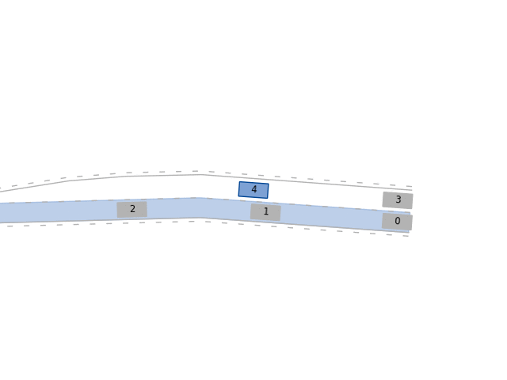

Before diving deeper into the [building blocks](/tutorials/building_blocks/) of BARK, let us first run a simple example.
<br />
An example provided in BARK can be run, e.g. the merging scenario using `bazel run //examples:merging`:

<div align="center">



</div>
The ego vehicle is displayed in blue and the other vehicles in gray.
The ego vehicle's goal is depicted on the left lane by the blue polygonal area.
Each vehicle in BARK has a unique ID displayed as a number on the vehicle.
Now, that we know how to run an example, let us go into some details.
<br /><br />

First, we need to import all required modules:
```python
from modules.runtime.commons.parameters import ParameterServer
from modules.runtime.viewer.matplotlib_viewer import MPViewer
from modules.runtime.scenario.scenario_generation.config_with_ease import \
  LaneCorridorConfig, ConfigWithEase
from modules.runtime.runtime import Runtime
# bark c++ imports
from bark.world.opendrive import *
from bark.world.goal_definition import *
from bark.models.behavior import *
```
This includes the `ParameterServer` storing all parameters, the `MPViewer` viewer for rendering, the `ConfigWithEase` scenario generation and the `Runtime`.
Additionally, we also import the BARK goal definitions, OpenDrive map helpers and the behaviors.
<br />
<br />


Parameters can easily be set as follows:

```python
param_server = ParameterServer()
param_server["BehaviorIDMClassic"]["DesiredVelocity"] = 10.
```

Next, after importing the modules and setting the basic parameters, we want to specify the scenario the ego vehicle drives in.
In the merging example, we place vehicles on both lanes with the ego (controlled) vehicle starting on the right lane.<br/>
To configure the left and right lane of the merging scenario, we can use the following code:

```python
# configure both lanes
left_lane = CustomLaneCorridorConfig(params=param_server,
                                     lane_corridor_id=0,
                                     road_ids=[0, 1],
                                     behavior_model=BehaviorMobilRuleBased(param_server),
                                     s_min=0.,
                                     s_max=50.)
right_lane = CustomLaneCorridorConfig(params=param_server,
                                      lane_corridor_id=1,
                                      road_ids=[0, 1],
                                      controlled_ids=True,
                                      behavior_model=BehaviorMobilRuleBased(param_server),
                                      s_min=0.,
                                      s_max=20.)

scenarios = \
  ConfigWithEase(num_scenarios=3,
                 map_file_name="modules/runtime/tests/data/DR_DEU_Merging_MT_v01_shifted.xodr",
                 random_seed=0,
                 params=param_server,
                 lane_corridor_configs=[left_lane, right_lane])
```

In this case, the `ConfigWithEase` scenario generation produces three (`num_scenarios=3`) scenarios.
<br/>
<br/>

At this point we are almost ready to run the scenarios.
Now, we only need to specify the viewer and the runtime:

```python
viewer = MPViewer(params=param_server,
                  x_range=[-35, 35],
                  y_range=[-35, 35],
                  follow_agent_id=True)
env = Runtime(step_time=0.2,
              viewer=viewer,
              scenario_generator=scenarios,
              render=True)
```

The scenarios in BARK can be run as simple as:
```python
# run 3 scenarios
for _ in range(0, 3):
  env.reset()
  # step scenario 90 time-steps
  for step in range(0, 90):
    env.step()
    time.sleep(sim_step_time/sim_real_time_factor)
```


## Other Examples
The other examples can be run in a similar fashion using:

* `bazel run //examples:highway`: Two-lane highway example
* `bazel run //examples:intersection`: Three way intersection
* `bazel run //examples:interaction_dataset`: Dataset replay
* `bazel run //examples:benchmark_database`: Benchmarks behaviors using a scenario database